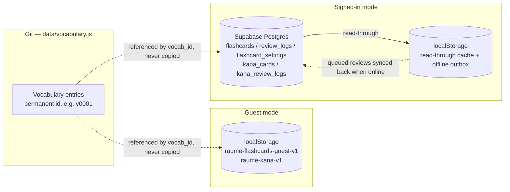

# raume

A fast, static reference site for Japanese food, kitchen, and N5 vocabulary,
with an FSRS-scheduled flashcards trainer built on top. Made for quick lookups
while cooking or studying, and for printing clean A4 study sheets.

Live at [xxvazquez.github.io/raume](https://xxvazquez.github.io/raume/).

No framework and no build step — plain HTML, CSS, and classic `<script>` tags.
Open `index.html` and it runs, even straight from `file://`.

---

## The reference

Four sections in the nav: **Vocabulary** (the landing page), **Grammar**,
**Travel**, and **Flashcards**. Within Vocabulary the tables are grouped by
category — Food & Ingredients, Kitchen & Dining, Numbers & Counting.

### Finding things

- **Jump to a table.** Each section opens with this control (`#tableIndex`),
  labelled *Jump to a table*. Collapsed, it just names the table you're on.
  Expanded, it lays out the whole section — every category and table, with entry
  counts — in two columns on desktop or a bottom sheet on mobile. The current
  table is marked in the section colour. Keyboard-navigable, hidden during a
  search, never printed.
- **Search** ranks results by match quality (exact → starts-with → ends-with →
  contains), highlights the matched text, and pulls from every section, not
  just the one you're viewing. It only searches columns that are visible.
- **Sticky controls.** The search field and column filters stay pinned below
  the nav as you scroll a long table.
- **URL hash.** The current view is reflected in the hash (`#grammar`,
  `#table-15`, `#flashcards`), so a section or table can be bookmarked or
  shared, survives a reload, and works with browser back/forward.

### Reading the tables

- **Columns.** Toggle **Japanese / Furigana / Romaji / English** in the
  toolbar. Furigana hides just the readings, not a whole column. You can't hide
  all three of Japanese / Romaji / English at once. A hidden column keeps its
  width and rules — the text just goes transparent, so nothing reflows — its
  cells are `aria-hidden`, and its sort button is disabled.
- **Furigana** sits over the exact kanji it belongs to and is always shown,
  never behind a hover or toggle. It has an 11px floor so it stays legible when
  the Japanese shrinks on narrow screens.
- **Table width.** The three text columns don't need the full sheet, so the
  reading column is capped (`--reading-w`) and left-aligned — the category
  rules, the tables and the Expand-all control all share that right edge
  instead of a row running out to a field of white. On a narrower viewport the
  cap is simply never reached; in print it's dropped so sheets fill the page.
- **Reading layer.** Hover (or tap, then tap away) a kana in a table to see its
  romaji above it. `js/vocab/kana-romaji.js` is a small standalone converter —
  it handles yōon (きゃ→kya), foreign-sound combos (ファ→fa), the long-vowel
  mark ー, and the sokuon っ/ッ. The romaji is drawn with CSS `::after`, so it
  never enters the DOM text and search and sort stay clean.
- **Show polite.** Switches the verb tables between plain/dictionary form and
  polite 〜ます. It only appears while the Verbs table is expanded — however that
  table was opened, including landing on it straight from a `#table-N` bookmark or
  the *Jump to a table* list.
- **Pronunciation.** A small speaker icon next to the Japanese plays it aloud,
  via the browser's own Web Speech API (`RaumeStudy.shared.speech`,
  `js/shared.js`) — no audio files, nothing to download, and it covers every
  row (a verb-pair row gets one button per form). It speaks the reading, not
  the kanji, and only appears once the browser confirms it actually has a
  Japanese voice installed, so a device with none never shows a button that
  would silently do nothing. The same control sits on a flashcard's Japanese
  prompt (see *Reviewing* below).
- **Sorting.** Every column is sortable (↓ A–Z / low→high, ↑ the reverse).
  Tables start sorted A–Z by English.
- **Named for assistive tech.** Each `<table>` is `aria-labelledby` its visible
  title, so a screen reader announces it by name ("Cooking Ingredients, table")
  rather than a bare "table".

### Study aids

- **Cover answers** blanks the English column. A reminder line appears, and
  tapping a row reveals that one answer (tap again to hide). It's a
  cover-and-check aid, not a quiz — no score, and it resets on reload.
- **Star** any row to build a lightweight watch list — between hiding a row
  ("I know this") and adding it to flashcards ("I'll drill this"). Once
  anything is starred, a **Starred** button in the toolbar swaps the list for a
  synthetic table of just those words, which sorts and prints like any other.
  It's a filter, not a page: switching section or searching clears it.
- **Hide a row.** The eye icon in the row's action cluster hides it — a
  quiet, per-table "I know this" — with a one-click "Show all" to bring
  everything back. No mode to turn on first; it's just always there.

### Customising tables

- **Icons.** Every table header has an icon slot — a faint "+" until you
  set one. The picker has ~165 curated monochrome line icons (a Lucide subset)
  in five groups, plus **Upload image…** for your own (downscaled to 64px,
  stored as a data URL).
- **Names and order.** The masthead settings button (the sliders icon) opens a
  **Customize** page: rename any table (blank = keep the shipped name), and use
  ▲▼ to move a table within its
  category or a category within its section. Custom names, icons, and order
  then show everywhere the table appears, including Flashcards › Manage. Each
  row's icon, name field and reset stay one tight cluster — the name field
  isn't stretched to the page's full width just because the page has room.
- Customisations save to `localStorage` immediately. Signed in, they also sync
  (a `table_custom` column on `flashcard_settings`). Signing in merges per
  table — the account wins for tables it already has; guest customisations for
  other tables are pushed up, not dropped.

### Printing

A4-friendly, at three scopes:

- the printer icon on a table prints that table;
- **Print…** (next to Expand all) prints the whole section, or the whole
  reference.

Collapsed tables still print their rows, and tables flow down the page rather
than one per sheet.

### Elsewhere

- **Theme.** A header control cycles **System → Light → Dark**. System follows
  the OS live. `js/theme-init.js` applies the choice before first paint, so
  there's no flash.
- **Help.** The masthead **?** opens a short rundown of the reference side.
  (Flashcards has its own Help tab.)
- **Layout memory.** An untouched section lands with every table collapsed —
  nothing presumed more relevant than anything else. Once you expand or
  collapse anything, the section keeps that layout when you leave and come
  back. Opening a table collapses the others in its category. **Expand all**
  opens everything at once; **Collapse all** closes it back down.
- **Mobile.** The sheet goes full-width; the four-item nav still fits on one
  line.

---

## Flashcards

Flashcards sit on top of the vocabulary without changing or copying it. Add a
whole table at once with **Add to flashcards** (it skips rows you've hidden),
or use the per-row toggle in the icon cluster pinned to the end of every
meaning — the same spot on every row regardless of how long the text is,
ghosted at rest so a long table doesn't grow a hard column of colour, full
strength on row hover or keyboard focus, and lit in the section accent once
the word is added. (The star and hide-row icons share that same cluster.) The
**Flashcards** nav page is where you review, browse, and track a daily streak.

### How cards work

- Scheduling is real **FSRS-6**, via
  [`ts-fsrs`](https://github.com/open-spaced-repetition/ts-fsrs) — the
  reference implementation, from the same people behind Anki's FSRS — vendored
  as a static file.
- Each vocab entry becomes up to four cards: **JP→EN, JP→Romaji, Romaji→EN,
  EN→Romaji**. Never Japanese-to-type. Rows whose romaji is still kana get
  JP→EN only.
- **Study directions** (in Settings) chooses which of the four a session draws
  from. Turning one off just leaves it out of review — it never touches those
  cards or their history.
- A session is one shuffled pool: every card that's due (plus learning steps
  coming due within 20 minutes) and the day's new-card allowance, in a fresh
  random order each time, spaced so a word's other directions don't land back
  to back. FSRS decides which cards are due and when they return — not their
  order within the session.
- Cards reference a row's **permanent id** (`v0001`…), never a copy of its
  content.

### Reviewing

- A session runs card → check → rate. Every rating is saved immediately, so
  **End session** never loses anything. The card and the wrap-up sit centred in
  the panel while a session is running, rather than at the top of the viewport.
- Checking an answer washes the whole card once in the matching tone (green /
  rose) and shows the verdict a size up — the loop's pass/fail signal, gone by
  the time you rate. The wash is skipped under `prefers-reduced-motion`.
- Fully keyboard-driven: type the answer, **Enter** to check (works straight from
  the answer field), then **1–4** to rate and move on. Space also checks when the
  field isn't focused.
- The card is a persistent shell — the answer field is the same element from the
  first card to the last, kept focused through check → rate → next. Only the
  prompt and the result region under it are swapped in place. Rebuilding the card
  each step (the earlier approach) dropped focus and closed the on-screen
  keyboard on every card on a phone, with no way back in.
- Works with a screen reader: the answer field is named with its prompt; the
  result region is an `aria-live` area, so checking announces the outcome, what
  you typed and the correct answer without moving focus off the field (that focus
  move was what closed the mobile keyboard). The result stays reachable
  (`tabindex="-1"`, an aria-label with the full summary). The wrap-up heading
  does take focus, since the session's over and there's nothing to type.
- The reveal below a checked answer shows one extra field of context, not
  just the one you were tested on — whichever of Japanese/romaji/English
  isn't already on screen as the prompt, so every review reinforces the
  whole word. Quiet text above the emphasised answer, never repeating the
  prompt itself (an `en-ro` card, for instance, adds Japanese, not English
  again). Included in the same screen-reader announcement as the answer.
- The four rating buttons are tone-coded, each its own hue rather than a
  wrong→right intensity spectrum (a stepped version shipped once and read as
  Hard barely mattering next to Again): **Again** in the wrong tone, **Hard**
  in a muted amber, **Good** in the right tone, **Easy** in the accent —
  so the choice is muscle memory, not a read-all-four every card. Each
  carries its **1–4** key as a small chip. After a wrong or blank answer,
  Good/Easy are dimmed (still one click away) so the honest rating reads
  first.
- Romaji checking ignores long vowels — you can't type macrons — so `kōhī`,
  `koohii`, and `kouhii` all match.
- Finishing shows a wrap-up (reviewed, correct, streak), with **Keep going** if
  more cards are ready.
- A Japanese prompt (jp-en / jp-ro) carries the same speaker button as the
  vocabulary tables — see *Pronunciation* above.

### The tabs

- **Dashboard** — before any cards, an empty state pointing at the next step.
  With cards: today's progress, a status line that mirrors the Study now
  button (it always carries a second line — the next review time, or the queue
  make-up on a fresh deck), four stat tiles (streak, total cards, reviews done,
  and estimated retention — "Not enough reviews yet" until ≥ 5 cards are
  reviewed), a New → Learning →
  Review progress bar, a reviews-this-week chart (a plain "no reviews yet this
  week" line until you've studied), a "Missed today" shortlist, and a **Words
  to review** table for words missed more than once. That table carries the
  same Japanese / Furigana / Romaji / English column toggles as the reference
  pages, so you can cover one side and quiz yourself off it — the toggles are
  the shared ones, so a column hidden here is also hidden on Vocabulary /
  Grammar / Travel. Until there's any review history the last two fold into a
  single "Words to review" line rather than two near-empty cards.
- **Manage** — every table by category, filterable to All / My flashcards /
  Archived. One button per table: **Add table**, then **Pause table** once it's
  fully added. Expand a table to add or pause individual words. "Add table" is
  ghosted at rest — it's the common case down a long, mostly-untouched list —
  while a fully-added table's count picks up the section accent, so the one
  thing this tab exists to show (what's already in your deck) is what actually
  catches the eye.
- **Settings** — Study directions, the FSRS knobs (retention, max interval,
  fuzz) and new-cards-per-day for the vocabulary cards, then the same four for
  the Kana trainer in their own section (which points back to the vocabulary
  descriptions rather than repeating them), all under one **Save settings**
  button. The two trainers' knobs are independent. Values save locally first,
  then sync. Each field's label sits right next to its control, not flung to
  the row's far edge with the helper paragraph starting under the gap.
  New-cards-per-day is a genuine daily allowance, not a per-session one — it
  holds across however many separate sessions you run in a day (device-local,
  same as everything else on this page not explicitly marked as synced).
- **Help** — pausing, the Manage status icons (○ ● ◷ ◌), and the review
  keyboard shortcuts (Space/Enter to check, 1–4 to rate).
- **Kana** — a separate hiragana/katakana trainer (below).

### Kana trainer

Not built on the vocabulary. Pick which groups to drill — **gojūon, dakuten,
handakuten, yōon, sokuon**, per script — and which directions. Each item ×
direction is its own FSRS-6 card.

- **Kana → romaji** — type the reading. A few alternate spellings are accepted
  (`si` for `shi`, `wo` for を). Unlike the vocab cards, this checks vowel
  length: `ō` and `oo` match either way, おう accepts `ou` / `oo` / `ō`, but a
  short vowel never matches a long one (`ii` is wrong for い).
- **Romaji → kana** — the romaji is shown; type the kana glyph (you'll want a
  kana keyboard or IME). Graded on the glyph itself — typing the romaji back
  doesn't count.
- Both directions are typed and checked the same way, and both count toward the
  wrap-up accuracy. Both are on by default; the picker keeps at least one on.
- Same review card as the vocab sessions, including the persistent-shell
  behaviour (one answer field kept focused across every card) and the
  screen-reader behaviour (prompt-named field, the result announced from an
  `aria-live` region without the focus leaving the field).
- Scheduling uses its own FSRS knobs (retention, max interval, fuzz, new-per-day)
  set in the Settings tab — separate from the vocabulary cards, so kana can run a
  tighter or looser schedule than words.

### Accounts and storage

Two modes that never mix. The Flashcards page opens on a plain choice between
them — two cards, both with a quiet outline button; the guest card carries a
soft teal tint as the only nudge toward the zero-setup path.

- **Guest** — everything stays in this browser's `localStorage`. No account, no
  network.
- **Signed in** — a **Supabase** project you create yourself (see
  [`SUPABASE_SETUP.md`](SUPABASE_SETUP.md)) becomes the authoritative store,
  scoped per account by Row Level Security. `localStorage` is then just a
  read-through cache and an offline outbox: reviews made offline are computed
  locally and synced when you reconnect. A status chip under your identity
  shows `Offline…` / `Syncing N reviews…` / nothing. Reviews still in that
  outbox are folded into the dashboard's history straight away, so "Today", the
  weekly chart and "Words to review" reflect what you've just done even before
  it syncs; once the outbox drains the dashboard re-reads from the server.
- **Forgot password?**, on the sign-in form, emails a reset link (Supabase's
  `resetPasswordForEmail`) instead of a second competing button — a quiet
  text link, since it's a way out of the form, not another call to action.
  Following the link lands back on the site already holding a recovery
  session; the app recognises that on its own (no route to remember) and
  shows a single "Set a new password" screen in its place, with **Cancel**
  signing that session back out rather than leaving it live unintended.

The anon key in `js/config.js` is safe to commit — Row Level Security protects
the data, not the secrecy of that key. The service-role key must never go in
the repo.

Pausing a card **archives** it: the FSRS state and full history are kept, and
re-adding restores the same card. Nothing is ever hard-deleted.

---

## Data and storage model

Vocabulary content lives only in Git. Both storage modes hold nothing but a
reference to it (`vocab_id`) plus your own learning data.



The signed-in schema is [`supabase/schema.sql`](supabase/schema.sql) — five
tables (`flashcards`, `review_logs`, `flashcard_settings`, `kana_cards`,
`kana_review_logs`), all under Row Level Security so each account only sees its
own rows. `flashcard_settings` also holds the FSRS knobs, the streak counters,
`kana_prefs` (the Kana tab's group + direction picker) and `kana_fsrs` (its
separate FSRS knobs). Guest mode mirrors the same shape in `localStorage`. On
first sign-in, guest progress is seeded up once, unless the account already has
cards.

`localStorage` keys are prefixed `raume-` (theme, `raume-table-custom`,
`raume-flashcards-*`, `raume-kana-*`). Installs from before the sakura → raume
rename are moved across once by [`js/storage-migration.js`](js/storage-migration.js),
a tiny `<head>` script that runs before anything reads a key.

---

## Project layout

```
index.html            page shell; the <script> block documents load order
css/site.css           all styling + A4 print rules
js/
  storage-migration.js  moves old sakura- localStorage keys to raume- (<head>)
  theme-init.js         sets the theme in <head>, before first paint
  config.js             Supabase URL + anon key
  shared.js             cross-feature helpers
  sw-register.js        service-worker registration
  vocab/                the reference page
    kana-romaji.js       kana → romaji converter (the reading layer)
    icons.js             curated line-icon set (a Lucide subset)
    icon-picker.js       the reusable icon picker
    table-custom.js      per-table names / icons / starred rows
    customize.js         the Customize page
    render.js            tables, nav, sorting
    interactions.js      routing, search, view modes, print, theme
  flashcards/           the Flashcards feature
    store.js             state + local storage
    vocab-index.js       lookup + answer checking
    scheduling.js        FSRS-6 + the session queue
    data-ops.js          auth, Supabase sync, guest store, streak
    dashboard.js         the Dashboard tab
    views.js             the Manage / Settings / Help tabs
    kana-data.js         built-in kana tables + practice groups
    kana.js              the Kana tab
    bootstrap.js         app shell + init
data/vocabulary.js     the vocabulary, as plain data; every row has a permanent id
vendor/                vendored ts-fsrs + supabase-js
fonts/                 self-hosted Inter + Space Grotesk (SIL OFL)
supabase/schema.sql    Postgres tables + Row Level Security
sw.js                  service worker (offline app shell)
manifest.webmanifest   PWA manifest
favicon.png            48px favicon (index.html links this, not logo.png)
icons/                 PWA app icons — see scripts/generate-icons.py
logo.png               master mark; source art for the favicon + icons, not served
scripts/               vocab validator, id + icon generators, smoke + SW tests
```

---

## Architecture

- **Vanilla JS, no build.** Classic `<script>` tags in a fixed order (see the
  comment block in `index.html`). No bundler, no modules, no TypeScript. Works
  from `file://`.
- **One global.** Everything hangs off `window.RaumeStudy`, with a
  sub-namespace per area (`.data`, `.config`, `.shared`, `.vocab`,
  `.flashcards`). A file only reads namespaces populated by a file loaded above
  it. Vendored libraries keep their own globals (`window.FSRS`,
  `window.supabase`).
- **Adding a JS file** means updating all of: `index.html` (script tag +
  load-order comment), `sw.js`, the test shells in `scripts/sw-test.js`, and
  the `validate` script in `package.json`. Miss one and `npm test` fails.
- **Strict CSP.** No inline styles — all positioning and styling goes through
  CSS classes, and the smoke test enforces it.

---

## Design

The wordmark **raume** sits at the left of the header, opposite a small
`JAPANESE REFERENCE`. It's set in
[Space Grotesk](https://fonts.google.com/specimen/Space+Grotesk), the one place
a second typeface is used; everything else is [Inter](https://rsms.me/inter/).
Both are self-hosted (SIL OFL), no external font runtime. Hierarchy comes from
size, spacing, position, and colour — not bold weight or high contrast, on the
Flashcards side too (weight 400 by default, 500 for a genuinely active or
labelled state, one type scale shared with the reference side via the same
`--fs-*` tokens). The single exception is the review card's pass/fail verdict,
which gets a beat of real weight — see Reviewing above.

Each section carries one muted cool tone, used only on structural and
interactive elements (nav underline, category rules, active tabs, focus, sort
accents) — never on rows or large surfaces. `--section` is switched by
`body[data-active-*]`: `--sec-vocabulary` (blue), `--sec-grammar` (indigo),
`--sec-travel` (blue-green), `--sec-flashcards` (slate) — spread roughly 30°
apart around the cool half of the wheel so the four actually read as distinct
identities moving between sections, not near-duplicates.

One label, one style: a category name reads the same Title-Case-in-the-section-
tone wherever it appears (a vocab heading, the *Jump to a table* list, Flashcards
› Manage, the Customize page), and card titles are sentence case throughout
Settings and Help. Help and Settings are prose, so they're held to a readable
measure (680px). Manage runs the full sheet (its rows are content-driven, not
a proportional grid). The Dashboard gets its own, wider cap (900px) — uncapped,
its tiles and cards are sized as *fractions* of the sheet, so a 2-up row
ballooned into two ~600px panels holding a couple of words each; capped, the
top row, the four stat tiles and the viz cards also share one 12-column grid
past 620px, so a seam in one lines up with a seam in another.

Motion is light throughout — short opacity/transform transitions, chevron
rotations, one card wash on a checked answer — and a single
`@media (prefers-reduced-motion: reduce)` block near-instants all of it. Every
control takes the same focus ring (a 2px `--section` outline at a 2px offset,
the search box included), and the flashcard checkboxes are drawn to match the
rest — `appearance: none` plus a CSS tick, not the raw OS control.

The palette is deliberately quiet — a light sheet on a grey-blue ground, one
slate-blue accent, no warm tones. No pink, no gradients, no shadows beyond one
under the table overflow menu. It's defined as CSS custom properties in
`css/site.css`:

| Hex | CSS variable | Used for |
|---|---|---|
| `#2F3944` | `--ink` | primary text — dark blue-grey, never black |
| `#5F6B79` / `#8996A3` | `--muted` / `--faint` | secondary text (labels) / tertiary (counts, chevrons) |
| `#616D7B` / `#64707E` | `--romaji` / `--furigana` | the romaji column / the reading over each kanji — both at WCAG AA on `--paper`; furigana also has an 11px floor |
| `#EEF1F4` | `--page-bg` | the cool grey behind the sheet |
| `#FFFFFF` | `--paper` | the sheet and table surface |
| `#E3E8EC` / `#D3DBE2` | `--line` / `--line-strong` | hairline row rules / header and table-head rules |
| `#526D87` / `#405A73` | `--accent` / `--accent-strong` | the single accent — active nav/tabs/controls, focus, search-match wash |

A few more colours do a purely functional job: a slate wash
(`--irregular-bg` / `--irregular-ink`) marks irregular-verb rows, and study
feedback carries the only two saturated tones on the reference side — a muted
brick red (`--wrong`) for a wrong or missed answer, a muted eucalyptus green
(`--right`) for a correct one, each kept as quiet as the other.

The **Flashcards dashboard** is the one place the quiet-everywhere rule is
loosened: a data surface needs to be scannable. Still no gradients or shadows
and the same cool character, but the card-progress bar uses a three-step slate
ramp (`--fc-state-new` / `-learning` / `-review`, an ordinal New → Learning →
Review; steps validated for lightness separation and AA in both themes), and
reviews-this-week bars pick up the Flashcards section tone with today's bar at
full strength. The four stat tiles' left rule is quiet (`--line-strong`) by
default — Total cards and Reviews completed are plain running counts with
nothing to signal — except Day streak (the section tone; it's already an
achievement) and Estimated retention, which turns the same muted amber as the
rating row's Hard (`.fc-stat-attention`, reusing `--fc-hard`) only once it
drops meaningfully under the target set in Settings, so colour there means
something rather than decorating every tile alike. The "Missed today" list
gets a thin `--wrong` left rule — the one warm note on the surface otherwise.
All of it is scoped to `.page-flashcards`; the reference side stays monochrome.
The review card's rating row is the one other exception: it needs a fourth
hue (Again/Good/Easy reuse `--wrong` / `--right` / `--accent`, but Hard gets
its own muted amber, `--fc-hard`) rather than the site's usual two saturated
tones.

Dark mode isn't just an inverted palette — a few weights are tuned separately
where the light logic doesn't carry over. Text fields get their own fill
(`--field-fill`) and border (`--field-line`): a well below the page ground, so
an input reads as something you type into rather than a raised panel. Stacked
card outlines soften toward `--paper` (`--card-line`) so a column of them isn't
boxy, while table row rules gain a little (`--row-line`) so they don't vanish.
And `--furigana` drops a clear step below `--romaji` again (it collapses to one
tone otherwise), still clearing AA over `--paper`.

---

## PWA and offline

Installable and offline-capable once visited.

- **Android / Chrome / Edge** show an install prompt automatically; `sw.js`
  precaches the app shell and caches versioned assets as you browse.
- **iOS / Safari** — Share → Add to Home Screen. The `apple-touch-icon` and
  `apple-mobile-web-app-*` tags in `index.html` handle the icon, name, and
  chrome-less launch.
- The service-worker cache is named `raume-<sha>` — one per deploy, and the
  previous one is dropped on activate. Only the precache list in `sw.js` has to
  stay in sync with what `index.html` requests.
- App icons and the favicon are generated from `logo.png` (the master mark, a
  circular sun-over-water motif) by `scripts/generate-icons.py` — cropped to
  its bounding box, padded to a square, and centred with equal margins on an
  opaque `#f4f6f8` tile: 192/512 plain, 192/512 maskable (smaller, inside the
  80% safe zone), a 180 for iOS, and a 48px `favicon.png`. `logo.png` itself is
  not served — `index.html` links the small `favicon.png`, not the ~530 KB
  master art. Rerun the script after editing `logo.png`; needs Pillow + NumPy
  (dev-time only).

---

## Development

```bash
npm run validate            # check the vocab data is well-formed (no dependencies)
npm install && npm test     # render the page in jsdom and exercise it; runs the SW test too
npm run generate:vocab-ids  # assign ids to any new vocab rows
npm run generate:icons      # rebuild the favicon + PWA icons from logo.png (Pillow + NumPy)
npm run vendor:libs         # re-copy the vendored libs after a version bump
```

Run `validate` before committing data changes, and `test` before anything
touching `js/vocab/` or `js/flashcards/`. The smoke test is DOM-coupled —
expect to update its assertions when the markup changes on purpose, and add
coverage for new behaviour. It can't reach Supabase, so the signed-in path
needs a manual check.

Testing the service worker needs a real server (`python3 -m http.server`) —
browsers won't register one on `file://`. Everything else works from `file://`.

---

## Deploying

Pushing `main` triggers the GitHub Pages workflow
(`.github/workflows/pages.yml`), which swaps a cache-busting token for the
commit SHA and deploys. Set the repo's Pages source to "GitHub Actions" once.

---

## License

The code here is under the
[PolyForm Noncommercial License 1.0.0](LICENSE) — free to use, study,
self-host, modify, and share for any noncommercial purpose (personal study,
research, teaching, hobby projects); commercial use is not granted. The same
terms cover the original written content: the curated vocabulary selection in
`data/vocabulary.js` and the written explanations. The `raume` name, wordmark,
and logo are not covered — see [`NOTICE`](NOTICE).

The vendored libraries and fonts keep their own permissive licenses: `ts-fsrs`
and `supabase-js` are MIT and the Lucide-derived icon paths are ISC
(`vendor/*.LICENSE.txt`); Inter and Space Grotesk are under the SIL Open Font
License (`fonts/*.LICENSE.txt`).
