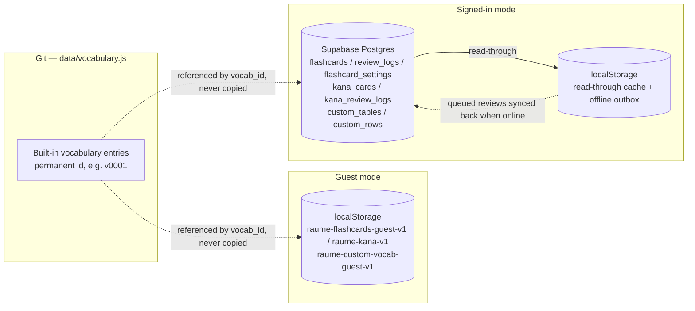

# Architecture

## Constraints

- **Vanilla JS, no build.** Classic `<script>` tags loaded in a fixed order (see
  the comment block in `index.html`). No bundler, no ES modules, no TypeScript.
  Everything works from `file://`.
- **One global.** Everything hangs off `window.RaumeStudy`, with a sub-namespace
  per area (`.data`, `.config`, `.shared`, `.vocab`, `.flashcards`, …). A file
  may only read namespaces populated by a file loaded *above* it in
  `index.html`. Vendored libraries keep their own globals (`window.FSRS`,
  `window.supabase`).
- **Strict CSP.** `style-src 'self'` with no `'unsafe-inline'` — inline
  `style="…"` attributes are blocked, and the smoke test asserts there are zero
  of them. All positioning and styling goes through CSS classes. `img-src` also
  allows `data:` so uploaded table icons can be data URLs.
- **Cache-busting.** Asset URLs carry `?v=__CACHEBUST__`; the Pages workflow
  replaces the literal token with the commit SHA on deploy. Leave the token in
  source.

## Adding a JS file

Update **all** of these or `npm test` fails:

1. `index.html` — the `<script>` tag *and* the load-order comment block
2. `sw.js` — the `VERSIONED` precache list
3. `scripts/sw-test.js` — `REFERENCE_SHELL` or `FLASHCARDS_SHELL`
4. `package.json` — add a `node --check` to the `validate` script

## Data and storage model

Built-in vocabulary content lives only in Git. Both storage modes hold nothing
but a reference to it (`vocab_id`) plus the user's own learning data — never a
copy of row content. The **one exception is custom vocabulary** (words and
tables the reader authors on the Customize page): that content has no home in
Git, so it is stored — in `localStorage` for a guest, in Supabase for a signed-in
account. See "Custom vocabulary" below.



- **Guest mode** — `localStorage` only (`raume-flashcards-guest-v1`,
  `raume-kana-v1`), no network.
- **Signed in** — Supabase Postgres is the sole authoritative store, scoped per
  account by Row Level Security. `localStorage` is a read-through cache plus an
  offline outbox: reviews made offline are computed locally, queued, and synced
  on reconnect (`syncOutbox` / `syncKanaOutbox` in `data-ops.js`). Each queued
  review is synced under a 20s timeout so a half-open connection can't leave the
  flag stuck and block every future retry; a review whose card no longer exists
  on the server (FK violation) is dropped rather than wedging the queue. The two
  modes never mix.
- The schema is [`supabase/schema.sql`](../supabase/schema.sql) — seven tables
  (`flashcards`, `review_logs`, `flashcard_settings`, `kana_cards`,
  `kana_review_logs`, `custom_tables`, `custom_rows`), all under RLS.
  `flashcard_settings` also holds the FSRS knobs, the streak counters,
  `kana_prefs` (the Kana picker), `kana_fsrs` (the Kana trainer's separate FSRS
  knobs), `paused_tables` (the tables paused as a unit — see below) and `leech_kept` (leeches marked Keep — see below). Setup
  guide: [`SUPABASE_SETUP.md`](../SUPABASE_SETUP.md).
- On first sign-in, guest progress is seeded up **once** — unless the account
  already has cards, in which case the account wins and guest data is ignored.
- **Table customisations** (names / icons / order) follow the same pattern (an
  unset icon falls back to the shipped table's default — or, for your own table, one
  suggested from its name — in `render.js`, never stored; a record is
  `{ name?, icon?, color?, hidden? }`, `color` a key from `icons.colors`,
  `hidden: true` = left out of the reference pages, directory and search —
  `render.js` `reflowLayout` marks it `.user-hidden` and parks it after every
  visible table; Reset keeps it, only Show clears it):
  `localStorage` is the immediate source of truth; signed in, they also sync via
  a `table_custom` column on `flashcard_settings`. Sign-in merges per table —
  account wins for tables it has; guest customisations for other tables are
  pushed up, not dropped. A change tells listeners what moved
  (`tableCustom.onChange(fn)` gets `{ id }` for an icon or colour pick, `null`
  otherwise): an icon/colour patches just that table's header and directory
  link; anything else (a name can re-sort the A–Z default) runs
  `applyTableOrder`, and `reflowLayout` only moves sections or rebuilds the
  directory when the order or markup actually changed. Customize re-renders
  only while it's on screen. Pushes to the account run one at a time and each
  sends the state as it is when it goes out (`saveTableCustomRemoteQueued`),
  so two quick edits can't land out of order and leave the account holding a
  value this device already cleared. Deleting a table of your own also
  forgets its record and its place in any saved order (`tableCustom.forget`),
  so nothing lingers in the settings row.
- **Custom vocabulary** (`js/vocab/custom-vocab.js`, `RaumeStudy.customVocab`) —
  the reader's own rows and tables. Two `localStorage` keys, mirroring the
  flashcards cache split: `raume-custom-vocab-guest-v1` (guest = authoritative)
  and `raume-custom-vocab-cache-v1` (signed-in = read-through cache of the
  `custom_tables` / `custom_rows` tables). A custom row's permanent id is
  `cv-<uuid>` and is what `flashcards.vocab_id` references, exactly like a
  built-in `v0001`; a custom table's id is `ct-<uuid>`. ids are
  client-generated (offline-safe), so both Supabase tables key on `text`, not
  `uuid`. `custom_rows.target_table` is a built-in table id as text (`"3"`) or a
  `custom_tables.id`. `applyToDataset()` merges every custom table/row straight
  into `RaumeStudy.data.vocabularyTables` (marked `__custom`) before the
  reference page renders and again whenever custom vocab changes or syncs, so
  every downstream feature — search, print, furigana, speech, the flashcards
  index — treats a custom word as just another row. Guests can add rows only
  (no custom tables); guest rows migrate up on first sign-in, like guest
  flashcard progress. Deleting a custom row/table is a real delete (no learning
  history on the content itself to keep).
- Each vocab entry maps to up to four independently scheduled cards (jp-en,
  jp-ro, ro-en, en-ro), never Japanese-to-type. Rows whose romaji is still kana
  get jp-en only. Pausing a word ("archive") keeps the FSRS state and full
  history forever; there is no hard delete.
- **Pausing a whole table** ("Pause table" in Manage) is an *overlay*, not a
  state on the cards: a flat list of table ids in `getCache().pausedTables`
  (synced to the `paused_tables` column). `studyableCards()` (scheduling.js)
  filters out any card whose table is in that list, so the queue and every stat
  tile skip it; the Manage filters hide it from "My flashcards" / "Archived".
  Each card's own `active` flag is untouched, so **Resume table** is a clean
  revert — a word paused individually before the table pause is still paused
  individually after. Sign-in unions the two lists (a device's pauses aren't
  dropped).

### Reading all of an account's rows

Supabase (PostgREST) returns **at most 1000 rows per request**. Every "load all
my rows" read — `flashcards`, `kana_cards`, `custom_tables`, `custom_rows`, and
the dashboard's `review_logs` windows — goes through `dataOps.fetchAllRows`,
which pages with `.order("id").range()` until a short page comes back. A plain
`.select()` silently stopped at 1000: past that, newly added cards were saved
but never loaded, so Add looked like it did nothing. Any new list query must
use the helper too.

### Guest backup

`js/flashcards/backup.js` (`RaumeStudy.flashcards.backup`) is guest-only —
signed-in data already lives in the account. `buildBackup()` snapshots four
things into `{format: "raume-backup", version: 1, exportedAt, data}`: the guest
flashcard cache (`raume-flashcards-guest-v1`), the guest Kana cache
(`raume-kana-v1`), table customisations (`raume-table-custom`) and the guest
custom vocabulary (`raume-custom-vocab-guest-v1`). Built-in vocabulary is never
included (cards reference it by `vocab_id`). `parseBackup()` re-runs every
section through the same validator the live app loads it with
(`store.validateCache` / `validateKanaCache`, `customVocab.sanitize`), so a bad
file drops invalid records but can't produce an unreadable shape, and refuses
files from a newer `version`. `applyBackup()` **replaces** those keys (a section
the backup lacked is cleared, not merged) and rolls every key back if any write
fails; the Settings tab then reloads the page so every module re-reads storage.
The keys come from constants those modules export
(`store.GUEST_CACHE_KEY` / `KANA_GUEST_KEY`, `tableCustom.STORAGE_KEY`,
`customVocab.GUEST_KEY`) rather than being repeated, so a renamed key carries
the backup along.

### localStorage keys

All prefixed `raume-` (`raume-theme`, `raume-show-polite`,
`raume-table-custom`, `raume-custom-vocab-*`, `raume-flashcards-*`,
`raume-kana-*`, `raume-customize-open-v1` — which of the Customize page's
collapsible sections a reader has open, keyed per item, browser-local only
(not part of the account sync any of the others above get), `raume-match-best` —
Puzzles › Match best times, one per source + script + pair count, also
browser-local only). Installs from
before the `sakura` → `raume` rename are migrated once by
[`js/storage-migration.js`](../js/storage-migration.js), the first `<head>`
script — it moves each key across and drops the old name.

Two more, both retry state for the account sync (see "Retrying a failed
account push" below), browser-local, never synced themselves:
`raume-custom-vocab-outbox-v1` (an ordered queue of custom-vocab writes that
failed to reach Supabase) and `raume-table-custom-dirty-v1` (a flag: the
account's copy of table customisations is stale).

**Leeches.** The detector is `scheduling.leechWords()`: per word, the worst
studyable card's `lapses` against `LEECH_LAPSES` (8, Anki's default), re-flagging a
kept word after `LEECH_RETRIGGER` (4) more lapses. Pausing from the Leeches card is
the ordinary per-word `archiveVocab`. **Keep** is `{ vocabId: lapses }` in
`getCache().leechKept` (`store.getLeechKept` / `keepLeech`) — in guest mode the
record itself, so a backup carries it; signed in it is mirrored to
`flashcard_settings.leech_kept` (`dataOps.keepLeech`) the way `paused_tables` is:
local first, and `fetchAllFromServer()` merges both sides (`store.mergeLeechKept`,
the higher lapse count per word winning) and pushes back whatever the account is
missing. The push is **best-effort** — a failure (offline, or `leech_kept` not there
because `schema.sql` hasn't been re-run) only logs a warning, never blocks other
sync, and heals on the next fetch. Nothing about a card is ever touched by it. The
first version's device-local `raume-flashcards-leech-kept-v1` key is folded into the
cache once and removed.

### Retrying a failed account push

Reviews, table customisations, and custom vocabulary are all local-first --
the change applies immediately regardless of connectivity -- and all retried
automatically on reconnect (or the Flashcards page's "Sync now"), not just
attempted once and logged. `js/flashcards/data-ops.js`:

- **Reviews** (`logsOutbox` / kana's own outbox, in the flashcards cache) --
  the original pattern here; a queue of individual entries, replayed FIFO by
  `syncOutbox()`/`syncKanaOutbox()`, one entry shifted off on success, the
  whole run stopping (not dropping) on failure.
- **Custom vocabulary** (`raume-custom-vocab-outbox-v1`) -- the same shape,
  applied to `js/vocab/custom-vocab.js`'s four remote writes: `*Queued`
  wrappers (`customVocabAddRowsQueued` etc.) try once immediately, and only
  queue the operation (`{op, payload}`) if that fails. `syncCvOutbox()`
  replays it the same FIFO way.
- **Table customisations** (`raume-table-custom-dirty-v1`) -- simpler, since
  `js/vocab/table-custom.js` always pushes its *whole* current state
  (idempotent, last-edit-wins), so there's no op log to replay -- just a
  dirty flag set on failure and cleared on success. `syncTableCustomIfDirty()`
  retries by pushing whatever the current state is *now*, not a stale
  snapshot of what failed.

All three fold into one `getSyncState()` (`pending`, `online`, `syncing`,
`stalled`), so the Flashcards sync chip and the masthead account icon (green
= synced, amber = offline or something pending) both reflect every source,
not just reviews. `pendingItems()` gives the itemised version of the same
three sources (raw ids/payloads, not display text) -- the chip's **What's
pending?** toggle resolves each one back to a word/kana character via
`vocabIndex`/the kana id's embedded character for its detail list.

## Project layout

```
index.html             page shell; the <script> block documents load order
css/site.css            all styling + A4 print rules
js/
  storage-migration.js  moves old sakura- localStorage keys to raume- (<head>)
  theme-init.js         sets the theme in <head>, before first paint
  config.js             Supabase URL + anon key
  shared.js             cross-feature helpers (HTML escape, pronunciation playback)
  sw-register.js        service-worker registration
  vocab/                the reference page
    kana-romaji.js       kana → romaji converter (the reading layer)
    icons.js             curated line-icon set (a Lucide subset)
    icon-picker.js       the reusable icon picker
    table-custom.js      per-table names / icons / order
    custom-vocab.js      the reader's own rows / tables, merged into the dataset
    customize.js         the Customize page
    render.js            tables, nav, sorting
    interactions.js      routing, search, view modes, print, theme
  flashcards/            the Flashcards feature
    store.js             state + local storage
    vocab-index.js       lookup + answer checking
    scheduling.js        FSRS-6 + the session queue
    data-ops.js          auth, Supabase sync, guest store, streak
    backup.js            guest-mode export / import of the on-device data (JSON file)
    dashboard.js         the Dashboard tab + the review session
    views.js             the Manage / Settings / Help tabs
    kana-data.js         built-in kana tables + practice groups
    kana.js              the Kana tab
    crosswords.js        the Puzzles tab: crossword/arroword/word search generator, play + print; timed Match game
    bootstrap.js         app shell + init
data/vocabulary.js      the vocabulary as plain data; every row has a permanent id
                        (adjective rows carry adj:"i" / adj:"na" for the type pill;
                        verb-pair rows carry verbClass:"godan" / "ichidan" / "irregular")
vendor/                 vendored ts-fsrs + supabase-js
fonts/                  self-hosted Inter + Space Grotesk (SIL OFL)
audio/                  prerendered pronunciation clips — see "Pronunciation audio" below
                        (not committed until generated; absent means Web Speech only)
supabase/schema.sql     Postgres tables + Row Level Security
sw.js                   service worker (offline app shell)
manifest.webmanifest    PWA manifest
favicon.png             48px favicon (index.html links this, not logo.png)
icons/                  PWA app icons — see scripts/generate-icons.py
logo.png                master mark; source art for the favicon + icons, not served
scripts/                vocab validator, id + icon + audio generators, smoke + SW tests
```

## Pronunciation audio

Every built-in word/phrase reading gets a prerendered clip so playback sounds
like a native speaker instead of the robotic-ish Web Speech API; anything not
in `data/vocabulary.js` (custom/imported vocab) has no clip and always uses
Web Speech.

- **Engine**: [VOICEVOX](https://voicevox.hiroshiba.jp/) — free, no account,
  no API key, runs as a local HTTP server. Generation only ever happens in
  `.github/workflows/generate-audio.yml`, triggered manually from the Actions
  tab; it is never part of `pages.yml` or any push-triggered deploy, and
  never runs on a contributor's machine automatically.
- **Filenames are content-addressed**: `scripts/generate-audio.js` computes
  `audio/<hash>.mp3` from an FNV-1a hash of `AUDIO_GEN_VERSION + "|" +
  <reading text>`, plus `audio/manifest.json` (the sorted list of hashes that
  exist). `js/shared.js` computes the identical hash at runtime and plays the
  file when the manifest lists it — the two copies of the hash function and
  `AUDIO_GEN_VERSION` **must be bumped together** if the voice or synthesis
  params ever change, so old and new audio never collide under one hash.
  Readings come from the same segments `jpReadingOf` already builds for the
  Web Speech fallback (kanji read via its furigana, never guessed).
- **Regenerating** (from the GitHub Actions tab, "Generate pronunciation
  audio" workflow):
  1. Run with mode `preview` — asks the engine's own `GET /speakers` for its
     real character/style list (never hardcoded — the id-to-character
     mapping lives in the compiled voice library, not anywhere source code
     can see it), picks a handful of "ノーマル" (Normal) styles, and
     synthesizes the sample words in each. Download the `audio-preview`
     artifact: the clips plus a `PREVIEW_SPEAKERS.txt` naming which speaker
     id is which character, straight from the engine.
  2. Listen, then run again with mode `full` and the chosen `speaker_id`
     input — generates every vocabulary reading in that one voice, and
     prunes any clip whose reading no longer exists.
  3. Download the `audio-full` artifact and unzip it over `audio/` in the
     repo (replaces `manifest.json`, adds/removes `*.mp3`). The workflow does
     not commit anything itself — commit `audio/` normally afterward.
- **Licensing**: VOICEVOX's character voice libraries require a credit line
  naming the voice wherever the audio is used. **Once a voice is chosen,
  update the credit in `README.md`'s License section** to
  `VOICEVOX:<character name>` for that specific voice.
- **Caching**: `sw.js` keeps prerendered clips in their own `raume-audio-v1`
  cache, separate from the per-deploy `raume-<sha>` cache — content-addressed
  filenames never change, so this cache survives a normal deploy instead of
  being wiped and re-downloaded every time. Clips are cached lazily (on first
  play), not precached at install, keeping the initial install small.
- **Playback speed**: both paths play at 0.8x (`js/shared.js`) — VOICEVOX's
  and the Web Speech API's default (1x) both read faster than is easy to
  follow for a learner sounding out an unfamiliar word.

## PWA and offline

Installable and offline-capable once visited.

- **Android / Chrome / Edge** show an install prompt automatically; `sw.js`
  precaches the app shell and caches versioned assets as you browse.
- **iOS / Safari** — Share → Add to Home Screen. The `apple-touch-icon` and
  `apple-mobile-web-app-*` tags in `index.html` handle the icon, name, and
  chrome-less launch.
- The service-worker cache is named `raume-<sha>` — one per deploy, previous one
  dropped on activate. Only the precache list in `sw.js` has to stay in sync
  with what `index.html` requests.
- App icons and the favicon are generated from `logo.png` (the master mark, a
  circular sun-over-water motif) by `scripts/generate-icons.py`: cropped to its
  bounding box, padded square, centred on an opaque `#f4f6f8` tile — 192/512
  plain, 192/512 maskable (inside the 80% safe zone), a 180 for iOS, and a 48px
  `favicon.png`. `logo.png` itself is not served. Rerun the script after editing
  `logo.png`; it needs Pillow + NumPy (dev-time only).

## Development

```bash
npm run validate            # check every JS file parses + the vocab data is well-formed (no deps)
npm install && npm test     # render the page in jsdom and exercise it; runs the SW test too
npm run generate:vocab-ids  # assign ids to any new vocab rows
npm run generate:icons      # rebuild the favicon + PWA icons from logo.png (Pillow + NumPy)
npm run vendor:libs         # re-copy the vendored libs after a version bump
```

Verb rows also carry `particles: [{ p: "を", role: "what you eat" }]` — the core
arguments a verb takes (`p` may be a pair like `"に / へ"`), `[]` for none — and 好き /
嫌い / 上手 / 下手 carry `が`. `npm run validate` requires the field on every verb and
checks each entry is a known particle with a role.

`npm run validate` also guards the い/な-adjective tags (`adj` / `adjNote` on a vocab
row): an `adj: "i"` reading must end in い; a `な`-adjective whose reading ends in い
(きれい, 嫌い, 有名) and an い-adjective in the いい family (いい, かっこいい →
よくない) must each carry an `adjNote`; `かわいい` is the one listed exception
(`REGULAR_II_ADJECTIVES`). A mis-tagged adjective fails the check instead of
shipping a wrong badge. An optional `usageNote` (多い, 古い, 遊ぶ) is a usage trap on a
regular adjective or verb — on a word it needs an `adj`; it keeps the plain
badge and shows in the ⓘ popover.

`english` holds only what a learner types; context for it goes in an optional
`enNote` (どの: `english: "which"`, `enNote: "before a noun"`). The note shows in
small grey under the English in the tables, under an English prompt or answer in
Flashcards, and in parentheses in lists and puzzle clues — it's never part of a
right answer. Parentheses left in `english` are optional words inside the answer
itself ("take (a day) off"); answer-checking accepts it with or without them.

Sentence tables can pair rows as a short exchange: a question row carries
`qa: "q"`, an answer row `qa: "a"` plus `answers: "<question id>"`. `validate`
checks that every answer names a question in its table and sits right after it
(or after another answer to the same question), and that every question has an
answer. `render.js` tags the rows `qa-q` / `qa-a` (the answer also
`data-answers`); search shows a pair whenever either line matches. Flashcards
are unaffected — each row is still its own card.

Every `verb-pair` row carries the same idea for its group: `verbClass` (`"godan"`
/ `"ichidan"` / `"irregular"`) drives the 五段/一段/変格 badge, and `verbNote` marks
the handful worth a second look (切る/帰る — 五段 despite looking 一段; 来る — its
kanji reading itself changes) with the outlined badge + a footnote. `validate`
checks the classification against the two forms already in the data: an
`"ichidan"` verb's polite form must be its plain form with る swapped for ます and
nothing else touched; a `"godan"` verb ending in -eru/-iru without a `verbNote`
fails, since it would silently read as ichidan in the UI.

- Run `validate` before committing data changes, and `test` before anything
  touching `js/vocab/` or `js/flashcards/`.
- The smoke test (`scripts/smoke-test.js`) is DOM-coupled — expect to update its
  assertions when the markup changes on purpose, and add coverage for new
  behaviour. It **cannot** reach Supabase, so the signed-in path needs a manual
  check.
- Testing the service worker needs a real server (`python3 -m http.server`) —
  browsers won't register one on `file://`. Everything else works from `file://`.

## Deploying

Pushing `main` triggers the GitHub Pages workflow
(`.github/workflows/pages.yml`), which swaps the cache-busting token for the
commit SHA and deploys. Set the repo's Pages source to "GitHub Actions" once.

`.github/workflows/generate-audio.yml` is separate and manual-only
(`workflow_dispatch`, not triggered by push) — see "Pronunciation audio"
above. It never runs as part of a deploy.
