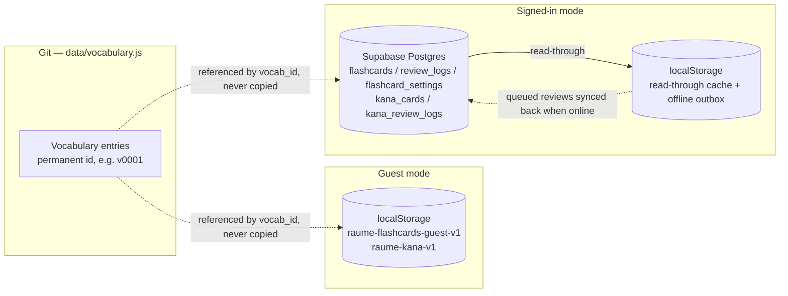

# Architecture

## Constraints

- **Vanilla JS, no build.** Classic `<script>` tags loaded in a fixed order (see
  the comment block in `index.html`). No bundler, no ES modules, no TypeScript.
  Everything works from `file://`.
- **One global.** Everything hangs off `window.RaumeStudy`, with a sub-namespace
  per area (`.data`, `.config`, `.shared`, `.vocab`, `.flashcards`, …). A file
  may only read namespaces populated by a file loaded *above* it in
  `index.html`. Vendored libraries keep their own globals (`window.FSRS`,
  `window.supabase`).
- **Strict CSP.** `style-src 'self'` with no `'unsafe-inline'` — inline
  `style="…"` attributes are blocked, and the smoke test asserts there are zero
  of them. All positioning and styling goes through CSS classes. `img-src` also
  allows `data:` so uploaded table icons can be data URLs.
- **Cache-busting.** Asset URLs carry `?v=__CACHEBUST__`; the Pages workflow
  replaces the literal token with the commit SHA on deploy. Leave the token in
  source.

## Adding a JS file

Update **all** of these or `npm test` fails:

1. `index.html` — the `<script>` tag *and* the load-order comment block
2. `sw.js` — the `VERSIONED` precache list
3. `scripts/sw-test.js` — `REFERENCE_SHELL` or `FLASHCARDS_SHELL`
4. `package.json` — add a `node --check` to the `validate` script

## Data and storage model

Vocabulary content lives only in Git. Both storage modes hold nothing but a
reference to it (`vocab_id`) plus the user's own learning data — never a copy of
row content.



- **Guest mode** — `localStorage` only (`raume-flashcards-guest-v1`,
  `raume-kana-v1`), no network.
- **Signed in** — Supabase Postgres is the sole authoritative store, scoped per
  account by Row Level Security. `localStorage` is a read-through cache plus an
  offline outbox: reviews made offline are computed locally, queued, and synced
  on reconnect. The two modes never mix.
- The schema is [`supabase/schema.sql`](../supabase/schema.sql) — five tables
  (`flashcards`, `review_logs`, `flashcard_settings`, `kana_cards`,
  `kana_review_logs`), all under RLS. `flashcard_settings` also holds the FSRS
  knobs, the streak counters, `kana_prefs` (the Kana picker), `kana_fsrs` (the
  Kana trainer's separate FSRS knobs) and `paused_tables` (the tables paused as
  a unit — see below). Setup guide: [`SUPABASE_SETUP.md`](../SUPABASE_SETUP.md).
- On first sign-in, guest progress is seeded up **once** — unless the account
  already has cards, in which case the account wins and guest data is ignored.
- **Table customisations** (names / icons / order) follow the same pattern:
  `localStorage` is the immediate source of truth; signed in, they also sync via
  a `table_custom` column on `flashcard_settings`. Sign-in merges per table —
  account wins for tables it has; guest customisations for other tables are
  pushed up, not dropped.
- Each vocab entry maps to up to four independently scheduled cards (jp-en,
  jp-ro, ro-en, en-ro), never Japanese-to-type. Rows whose romaji is still kana
  get jp-en only. Pausing a word ("archive") keeps the FSRS state and full
  history forever; there is no hard delete.
- **Pausing a whole table** ("Pause table" in Manage) is an *overlay*, not a
  state on the cards: a flat list of table ids in `getCache().pausedTables`
  (synced to the `paused_tables` column). `studyableCards()` (scheduling.js)
  filters out any card whose table is in that list, so the queue and every stat
  tile skip it; the Manage filters hide it from "My flashcards" / "Archived".
  Each card's own `active` flag is untouched, so **Resume table** is a clean
  revert — a word paused individually before the table pause is still paused
  individually after. Sign-in unions the two lists (a device's pauses aren't
  dropped).

### localStorage keys

All prefixed `raume-` (`raume-theme`, `raume-show-polite`,
`raume-table-custom`, `raume-flashcards-*`, `raume-kana-*`). Installs from
before the `sakura` → `raume` rename are migrated once by
[`js/storage-migration.js`](../js/storage-migration.js), the first `<head>`
script — it moves each key across and drops the old name.

## Project layout

```
index.html             page shell; the <script> block documents load order
css/site.css            all styling + A4 print rules
js/
  storage-migration.js  moves old sakura- localStorage keys to raume- (<head>)
  theme-init.js         sets the theme in <head>, before first paint
  config.js             Supabase URL + anon key
  shared.js             cross-feature helpers (HTML escape, Web Speech)
  sw-register.js        service-worker registration
  vocab/                the reference page
    kana-romaji.js       kana → romaji converter (the reading layer)
    icons.js             curated line-icon set (a Lucide subset)
    icon-picker.js       the reusable icon picker
    table-custom.js      per-table names / icons / starred rows
    customize.js         the Customize page
    render.js            tables, nav, sorting
    interactions.js      routing, search, view modes, print, theme
  flashcards/            the Flashcards feature
    store.js             state + local storage
    vocab-index.js       lookup + answer checking
    scheduling.js        FSRS-6 + the session queue
    data-ops.js          auth, Supabase sync, guest store, streak
    dashboard.js         the Dashboard tab + the review session
    views.js             the Manage / Settings / Help tabs
    kana-data.js         built-in kana tables + practice groups
    kana.js              the Kana tab
    bootstrap.js         app shell + init
data/vocabulary.js      the vocabulary as plain data; every row has a permanent id
vendor/                 vendored ts-fsrs + supabase-js
fonts/                  self-hosted Inter + Space Grotesk (SIL OFL)
supabase/schema.sql     Postgres tables + Row Level Security
sw.js                   service worker (offline app shell)
manifest.webmanifest    PWA manifest
favicon.png             48px favicon (index.html links this, not logo.png)
icons/                  PWA app icons — see scripts/generate-icons.py
logo.png                master mark; source art for the favicon + icons, not served
scripts/                vocab validator, id + icon generators, smoke + SW tests
```

## PWA and offline

Installable and offline-capable once visited.

- **Android / Chrome / Edge** show an install prompt automatically; `sw.js`
  precaches the app shell and caches versioned assets as you browse.
- **iOS / Safari** — Share → Add to Home Screen. The `apple-touch-icon` and
  `apple-mobile-web-app-*` tags in `index.html` handle the icon, name, and
  chrome-less launch.
- The service-worker cache is named `raume-<sha>` — one per deploy, previous one
  dropped on activate. Only the precache list in `sw.js` has to stay in sync
  with what `index.html` requests.
- App icons and the favicon are generated from `logo.png` (the master mark, a
  circular sun-over-water motif) by `scripts/generate-icons.py`: cropped to its
  bounding box, padded square, centred on an opaque `#f4f6f8` tile — 192/512
  plain, 192/512 maskable (inside the 80% safe zone), a 180 for iOS, and a 48px
  `favicon.png`. `logo.png` itself is not served. Rerun the script after editing
  `logo.png`; it needs Pillow + NumPy (dev-time only).

## Development

```bash
npm run validate            # check every JS file parses + the vocab data is well-formed (no deps)
npm install && npm test     # render the page in jsdom and exercise it; runs the SW test too
npm run generate:vocab-ids  # assign ids to any new vocab rows
npm run generate:icons      # rebuild the favicon + PWA icons from logo.png (Pillow + NumPy)
npm run vendor:libs         # re-copy the vendored libs after a version bump
```

- Run `validate` before committing data changes, and `test` before anything
  touching `js/vocab/` or `js/flashcards/`.
- The smoke test (`scripts/smoke-test.js`) is DOM-coupled — expect to update its
  assertions when the markup changes on purpose, and add coverage for new
  behaviour. It **cannot** reach Supabase, so the signed-in path needs a manual
  check.
- Testing the service worker needs a real server (`python3 -m http.server`) —
  browsers won't register one on `file://`. Everything else works from `file://`.

## Deploying

Pushing `main` triggers the GitHub Pages workflow
(`.github/workflows/pages.yml`), which swaps the cache-busting token for the
commit SHA and deploys. Set the repo's Pages source to "GitHub Actions" once.
